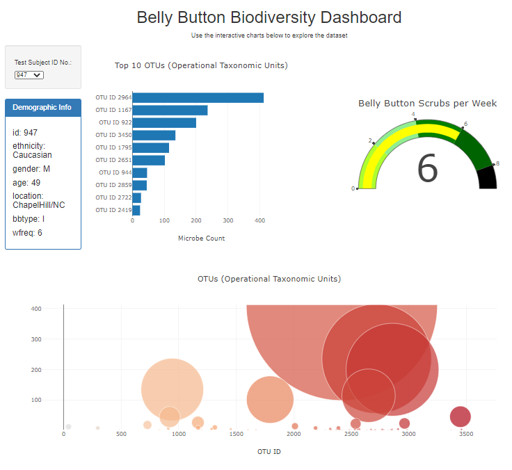

## plotly-bellybutton

# Interactive dashboard to explore the Belly Button Biodiversity
## JavaScript, D3.js, Plotly.js, HTML
 
This project combines JavaScript, D3.js, Plotly.js, HTML to create an interactive dashboard that allows users to explore the microbials in the human belly button.
  

The Belly Button site can be found here: 

https://jeremyhamley.github.io/plotly-bellybutton/

By using the dropdown, the user can select any Test Subject's ID and explore the data listed below.

 - The top 10 OTS's present in the individual  
 - The Demographic information for the individual
 - The number of Belly Button scrubs per week
 - The bubble graph of all OTUs present with a microbial count for each

 Hover over the Top 10 bar chart and the OTU bubble chart to explore the exact microbials present in each OTU.

